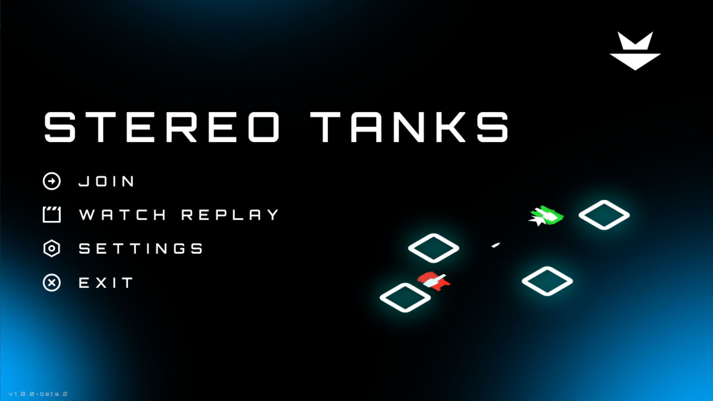

# StereoTanks



##  Game for HackArena 2.5

StereoTanks is a game developed for [HackArena 2.5](https://hackarena.pl/wydarzenia/hackarena_2_5), organized by KN init. This repository contains the game server and the GUI client, written in C# using the [MonoGame](https://monogame.net/) framework. The game can be played by both humans and bots, for which API wrappers are provided in other repositories.

The game is a simple tank battle where players control tanks and fight against each other on a 2D map. The goal is to get the highest score by collecting points, which are awarded for various actions,
such as taking damage or having a captured zone. Players can move, rotate, shoot bullets, and use various secondary items like lasers, double bullets, radars, and mines.

For a comprehensive guide to game mechanics, please refer to the [instruction manual](https://hackarena.pl/assets/instrukcja.pdf).


## Server

### Running the server

#### Windows

1. Download the appropriate zip file for your platform from the [releases](https://github.com/INIT-SGGW/HackArena2.5-StereoTanks/releases) page.
2. Unzip the downloaded file.
3. Run the server by double-clicking on the `GameServer.exe` file.
4. It will start the server with default settings. To check the available settings, type in the terminal:
    ```bash
    ./GameServer.exe --help
    ```

#### Linux / macOS

1. Download the appropriate zip file for your platform from the [releases](https://github.com/INIT-SGGW/HackArena2.5-StereoTanks/releases) page.
2. Unzip the downloaded file.
3. Add execute permissions to the server executable by running:
    ```bash
    chmod +x GameServer
    ```
4. Run the server by typing:
    ```bash
    ./GameServer
    ```
5. It will start the server with default settings. To check the available settings, you can use the `--help` flag:
    ```bash
    ./GameServer --help
    ```

#### Docker Container

1. Download the appropriate zip file for your platform from the [releases](https://github.com/INIT-SGGW/HackArena2.5-StereoTanks/releases) page.
2. Unzip the downloaded file.
3. Run the Docker container with the following command:
    ```bash
    docker run --rm -v ".:/app" -p "5000:5000" -it mcr.microsoft.com/dotnet/runtime:8.0 dotnet /app/GameServer.dll -- --host *
    ```

    > Running the server inside a Docker container requires setting the host flag to `*` so clients can connect from outside Docker.


### Server Options

The server accepts several options that can be passed as flags. You can check what options are available by running the server with the `--help` flag.

- **Join Code:** A join code can be set at server start to allow only players with the code to join the game.
  
- **Sandbox Mode:** This mode starts the game immediately after the server starts and lasts indefinitely. It is useful for testing purposes. In this mode, players (including bots) can join and leave the game at any time without needing to restart the server. Secondary items on the map generate when there is a player in the game.

- **Eager Broadcast:** Enabling this option significantly speeds up game execution. The game runs in a simple loop where the server sends the current game state to clients and waits for a broadcast interval (e.g., 100ms). With eager broadcast, the server immediately sends the next state to clients after receiving all player actions, reducing unnecessary delays. If a bot does not respond within the standard interval, the server will send the next state anyway.

- **Replays:** When replay is enabled, the server saves the game state in its original form to a file on every tick. This file can later be used to replay the game or for analysis purposes.


## GUI Client

### Running the GUI Client

#### Windows

1. Download the appropriate zip file for your platform from the [releases](https://github.com/INIT-SGGW/HackArena2.5-StereoTanks/releases) page.
2. Unzip the downloaded file.
3. Run the client by double-clicking on the `GameClient.exe` file.

#### Linux / macOS

1. Download the appropriate zip file for your platform from the [releases](https://github.com/INIT-SGGW/HackArena2.5-StereoTanks/releases) page.
2. Unzip the downloaded file.
3. Add execute permissions to the client executable by running:
    ```bash
    chmod +x GameClient
    ```
4. Run the client by typing:
    ```bash
    ./GameClient
    ```

### Playing the Game as a Player

To play the game as a player, select `JOIN` in the main menu and enter:
- Your nickname.
- The join code (if set on the server).
- The URL of the server. By default, if run locally, it should be `localhost:5000`.

Then press the `JOIN` button.

#### Controlling the Tank

- **W:** Move forward.
- **S:** Move backward.
- **A:** Rotate tank left.
- **D:** Rotate tank right.
- **Q:** Rotate turret left.
- **E:** Rotate turret right.
- **Space:** Shoot a bullet.
- **1:** Use a laser.
- **2:** Shoot a double bullet.
- **3:** Use a radar.
- **4:** Drop a mine.

### Watching the Game as a Spectator

To watch the game as a spectator, select `JOIN` in the main menu and enter:
- The join code (if set on the server).
- The URL of the server. By default, if run locally, it should be `localhost:5000`.

Then press the eye icon in the top right corner.


## Watching the Replay

To watch the replay of the game, ensure you have the replay file ready. The replay file must be located in the **"Replays"** folder in the same directory as the client executable. 

**Supported replay file formats:**
- `.json`
- `.txt`
- `.zip`
- `.tar.gz`
- No extension

**Note:** In version **v1.1.0**, only `.json` files are supported.

To watch a replay, go to the main menu, select **WATCH REPLAY**, and choose the replay file from the list.

### Controlling the Replay

- **Space:** Pause or resume the replay.
- **Left Arrow:** Go to the previous tick.
- **Left Arrow (hold > 0.5s):** Go to previous ticks faster.
- **Right Arrow:** Go to the next tick.
- **Right Arrow (hold > 0.5s):** Go to next ticks faster.
- **Left Control + Left Arrow:** Go back 1 minute.
- **Left Control + Right Arrow:** Go forward 1 minute.